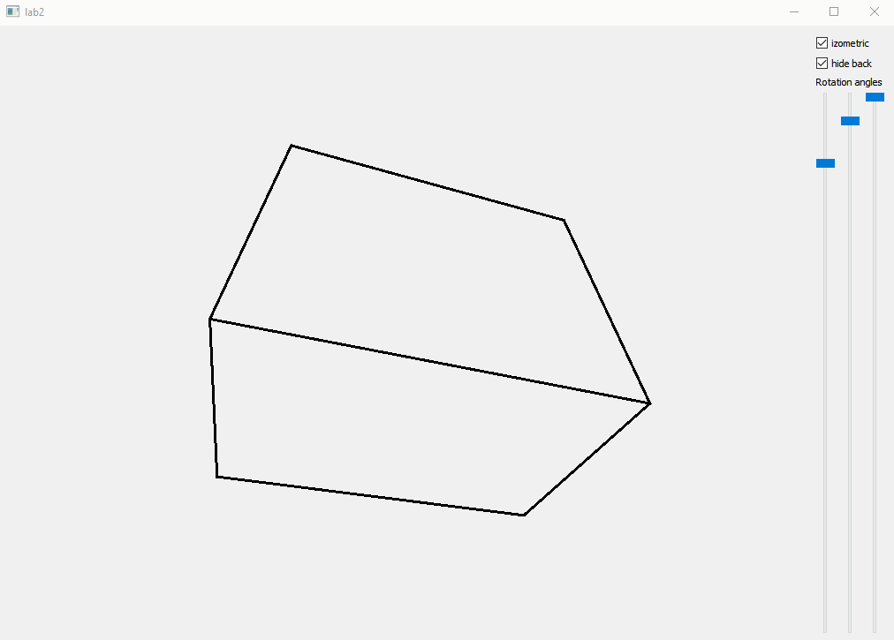

### Каркасная визуализация выпуклого многогранника, удаление невидимых линий

Приложение, которое позволяет визуализировать простые выпуклые 3D фигуры и применять к ним пространственные повороты вокруг трех измерений. Реализован простой движок с возможность представления любых выпуклых фигур, повороты фигур, а также некоторые изменения представления фигуры осуществляют при помощи матриц преобразования.

Для работы данного приложения требуется установить QT Creator, либо подключить нужные библиотеки.


### GIF



### Описание файлов

_abstractpaintitng3d.h/.cpp_ -абстракция для фигур, содержит метод calculatePolygons() который вызывается при отрисовке фигуры

_abstractpolygon3d.h/.cpp_ -  абстракция для полигонов, нужна, если нужно создать кастомный полигон

_cuboidclass.h/.cpp_ – куб, рисует куб.

_polygon3d.h/.cpp_ – полигон по трем точкам	

_rectpolygon3d.h/.cpp_ – полигон по четырем точкам

_scenemodifier.h/.cpp_ – сцена на которой происходят применение преобразований к фигурам, отвечает за отрисовку фигур

_transformer.h/.cpp_ – отвечает за преобразования, вычисляет итоговую матрицу преобразования

_transform.h /.cpp_ – содержит множество статических элементов, которые вычисляют матрицы преобразований (повороты, масштабирование)

_widget3d.h/.cpp_ – виджет, на который происходит отрисовка.

### Как создать свою фигуру

1. Создать класс и наследоваться от AbstractPainting3D

```c++ class CuboidClass : public AbstractPaintitng3D ```

2. Перегрузить метод paint()

3. Добавить фигуру в SceneModifier

