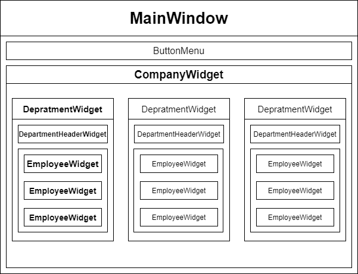
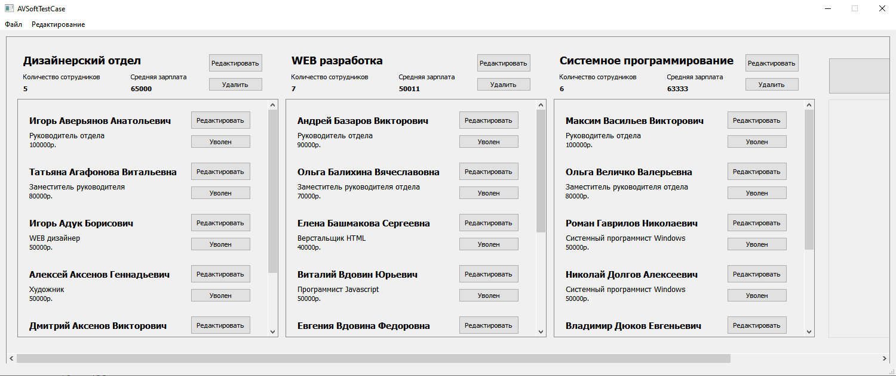
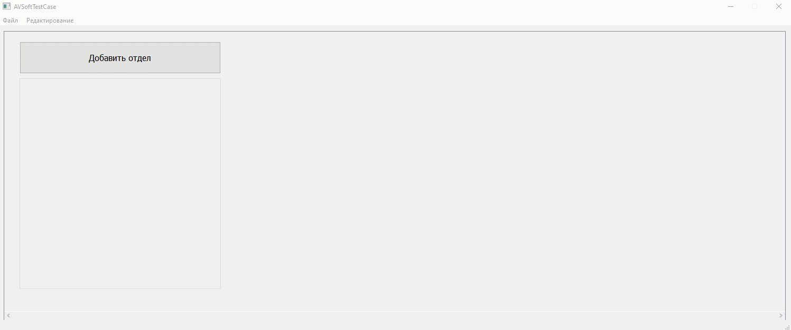

## Задание

Необходимо разработать приложение, отображающее список подразделений предприятия и его сотрудников в виде дерева. Список должен загружаться из файла формата xml. Программа должна обеспечить возможность добавления, удаления, редактирования подразделений и сотрудников в них. Программа должна обеспечить
возможность отмены и возврата изменений. При разработке необходимо использовать паттерны проектирования

Поля сотрудника:
* ФИО;
* должность;
* зарплата (целое число).

Поля подразделения:
* наименование;,
* количество сотрудников;
* средняя зарплата.

### Формат XML файла

_Пример XML файла:_

```XML
<?xml version="1.0" encoding="UTF-8"?>
<departments>
	<department name="Дизайнерский отдел">
		<employments>
			<employment>
				<surname>Аксенов</surname>
				<name>Алексей</name>
				<middleName>Геннадьевич</middleName>
				<function>Художник</function>
				<salary>50000</salary>
			</employment>
			<employment>
				<surname>Аксенов</surname>
				<name>Дмитрий</name>
				<middleName>Викторович</middleName>
				<function>Дизайнер интерфейса</function>
				<salary>45000</salary>
			</employment>
		</employments>
	</department>
	<department name="WEB разработка">
		<employments>
			<employment>
				<surname>Григорьев</surname>
				<name>Павел</name>
				<middleName>Владимирович</middleName>
				<function>Программист БД</function>
				<salary>60000</salary>
			</employment>
			<employment>
				<surname>Данилов</surname>
				<name>Николай</name>
				<middleName>Валентинович</middleName>
				<function>Администратор сайта</function>
				<salary>50000</salary>
			</employment>
		</employments>
	</department>
	<department name="Системное программирование">
		<employments>
			<employment>
				<surname>Васильев</surname>
				<name>Максим</name>
				<middleName>Викторович</middleName>
				<function>Руководитель отдела</function>
				<salary>100000</salary>
			</employment>
			<employment>
				<surname>Дюков</surname>
				<name>Владимир</name>
				<middleName>Евгеньевич</middleName>
				<function>Системный программист Linux</function>
				<salary>50000</salary>
			</employment>
			<employment>
				<surname>Емельянов</surname>
				<name>Дмитрий</name>
				<middleName>Юрьевич</middleName>
				<function>Системный программист Linux</function>
				<salary>50000</salary>
			</employment>
		</employments>
	</department>
</departments>
```

Другие примеры можно посмотреть [здесь](tests/).

### Проектирование

При выполнении данного задания будем использовать паттерн MVC (model-view-controller) и разделим приложение на несколько частей: часть абстракций – модель и часть визуализации и интерфейсам взаимодействия.

Так как используется паттерн MVC пользователь при выполнении функции (нажатий на кнопки) влияет на прямую на состояние модели, а не содержимое виджетов. Виджеты в свою очередь получают информацию не от действий пользователя, а напрямую у модели.

Модель может получать данные, как от пользователя, так и из других источников, в данном случае поддерживается возможность открытия и чтения XML файлов.  


### Модель

Модель представляется в виде строгой иерархии нескольких слоев компании: сотрудник привязан к отделу, а отделу привязаны к компании. Таким образом выделим несколько классов. 
Класс Employee содержит все необходимый поля о сотруднике. (ФИО, должность, зарплата)
Класс Department содержит название отдела и список сотрудников
Класс Сompany содержит список всех отделов. При этом, так как функционально не предусмотрена работы с несколькими компаниями, то будет создан только один экземпляр класса Company, к которому можно обратиться только через статический метод getInstance() (Паттерн Singleton). [Посмтреть файл с моделью](src/companymodel.h) и [реализацию](src/companymodel.cpp)

Таким образом модель можно представить следующим образом:


### Визуализация

Виджет визуализации будет состоять из нескольких вложенных в друг друга виджетов, изображенных на схеме в следующем порядке.



Итоговый вид программы




### Функционал

Пользователь может полностью управлять состоянием рабочего отдела – добавлять и удалять отделы, редактировать названия отделов, добавлять и удалять сотрудников, редактировать их данные. При этом программа динамически перестраивает виджет в зависимости от того, что сделал пользователь.

На следующей гифках изображена примерная работа программы и ее основные функции.




Кроме того, имеется система Undo/Redo через которую и осуществляются все действия пользователя. Последний выполненный шаг помещается в стэк из которого при надобности достается команда и выполняется обратное действие того, что сделал пользователь. Если пользователь хочет вернуть состояние, которое было перед применением undo – он может нажать ctrl + y или соответствующую кнопку в верхнем меню виджета во вкладке "Редактирование".

Команды системы Undo / Redo – классы, реализации абстрактного класса URScommand c переопределенными методами runDo() и undo() [Undo/Redo System заголовочный файл](src/undoredosystem.h), [Undo/Redo System реализация](src/undoredosystem.cpp)
